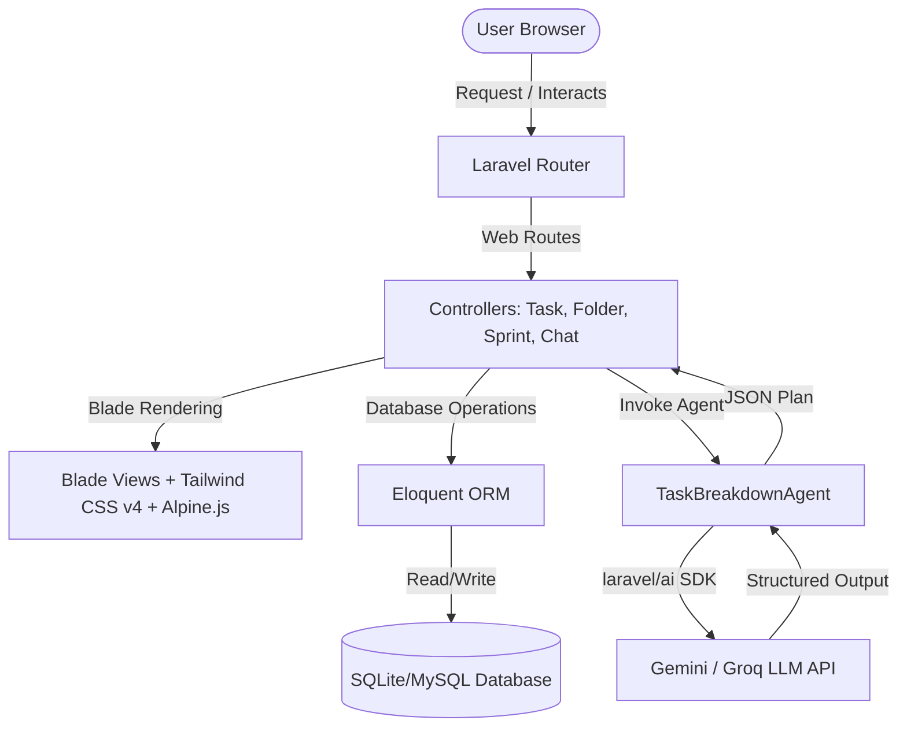
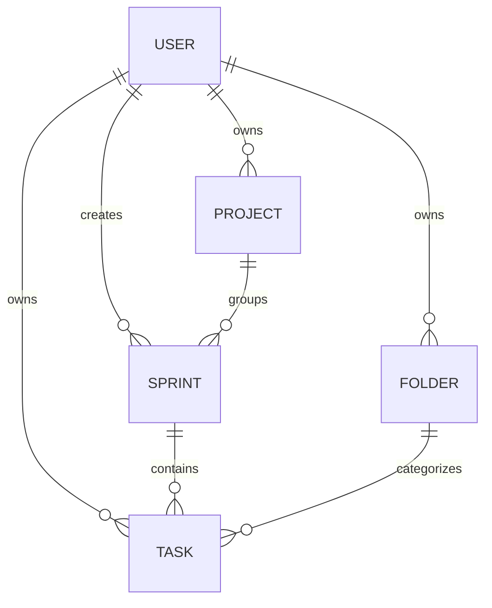

# CONTEXT.md — Smart Task (TaskMind)

A modern, minimalist Agile productivity tool and collaborative task management platform that bridges structured software development workflows with agentic AI planning.

---

## 1. Project Overview & Value Proposition

**Smart Task** (visually branded as **TaskMind**) is a high-performance productivity application designed to eliminate cognitive clutter and streamline project execution. The platform uniquely bridges the gap between two paradigms:
1. **Traditional Agile / Scrum:** Structuring work into Projects, Sprints, Story Points, Tasks, and Subtask checklists.
2. **Agentic AI Planning:** An interactive, conversational product-management companion that instantly translates a user's unstructured feature descriptions or goals into a fully scoped Agile roadmap (Sprints, Tasks, estimated effort, and checklists).

### Key Value Propositions
- **Low-Friction Ideation:** Instead of manually creating tickets, users describe their feature idea to an integrated AI agent, which generates an actionable backlog in seconds.
- **Visual Sprint Tracking:** Real-time feedback via interactive burndown charts driven by dynamic story point calculations and subtask completions.
- **Minimalist & High-Performance UX:** Designed around clean aesthetics (lavender/dark modes, glassmorphism, responsive grids) with snappy micro-interactions.
- **Bank-Grade Authentication:** Employs passwordless WebAuthn (Passkeys) and Two-Factor Authentication (2FA) out of the box.

---

## 2. Core Tech Stack & Architecture

Smart Task is built on a modern, unified PHP and JavaScript stack, favoring a server-driven architecture with granular client-side interactivity.

### Backend & Framework
- **Laravel 13 (PHP 8.4/8.3):** Serves as the core MVC framework, leveraging modern features like constructor property promotion and strict type declarations.
- **Laravel Fortify:** A frontend-agnostic authentication backend that manages credentials, secure password hashing, Two-Factor Authentication (with recovery codes), and WebAuthn Passkeys.
- **Laravel AI SDK (`laravel/ai`):** First-party SDK enabling native agentic patterns, conversation history tracking, and structured schema outputs.

### Frontend & Interactivity
- **Laravel Blade Components:** Powers clean, reusable UI layouts and component-driven template architectures (e.g., `<x-layout>`, `<x-task-card>`).
- **Tailwind CSS v4:** Integrated using `@tailwindcss/vite` for utility-first styling, featuring modern CSS variables, themes, and container-queries.
- **Alpine.js:** Embedded directly in Blade templates to handle lightweight client-side state, such as dropdown menus, search filters, and modal toggles.
- **Chart.js:** Used on the sprints dashboard to render SVG-based burndown charts dynamically based on historical sprint progress.

---

## 3. Key Features & Functionality

### 1. Interactive AI Task Planner & Chat
- **Interface:** A persistent floating action button (FAB) triggers a slide-out chatbot window.
- **Logic:** Calls the `TaskBreakdownAgent` which uses the `laravel/ai` SDK. It maintains conversation history using database-backed session storage (`agent_conversation_id`).
- **Structured Schema:** The AI does not return raw text; it is strictly bound to a JSON schema defining:
  - `message`: Friendly introductory response.
  - `project`: Project name and description.
  - `sprints`: Array of sprint names, goals, and tasks.
  - `general_tasks`: Tasks that do not belong to a sprint cycle.

### 2. "Commit Plan" Database Hydration
- Once the AI proposes a sprint and task breakdown, the user can review it directly in the UI.
- Clicking the commit button triggers an AJAX call to `/chat/commit-plan`.
- The backend automatically initializes or groups these under an **"AI Generated"** Folder, creates the `Project`, creates the `Sprints`, inserts the `Tasks`, and formats/casts subtasks into JSON arrays in a single transaction.

### 3. Dynamic Sprint Burndown Analytics
- **Story Point Allocation:** Tasks are assigned story points based on the Fibonacci sequence (1, 2, 3, 5, 8, etc.).
- **Subtask Fractional Burn:** If a task contains subtasks, its story points are divided proportionally. As each subtask is toggled, the corresponding fraction of the story points is "burned."
- **Burndown Chart Generation:** Inside [sprints/index.blade.php](file:///C:/Users/mahmoud/Desktop/elancer/todo/resources/views/sprints/index.blade.php), the backend calculates coordinates for:
  - **Ideal Burn Line:** A linear regression line mapping `total_points` down to `0` over the sprint dates.
  - **Actual Burn Line:** Tracks point completions on their respective completion dates, avoiding drawing lines into future dates.

### 4. Interactive Agile Dashboard & Kanban
- A sprint selector allows users to search and switch between sprints belonging to different projects.
- Subtask checklists can be toggled inline. Toggling a subtask sends an asynchronous POST request to the server, updates the task's JSON payload, and triggers a page refresh to update the burndown metrics.

---

## 4. Database & Data Models

The database is built on a clean relational schema with cascading deletes to maintain data integrity.

### Entity Overviews

#### 1. User
Represents system users and authenticating accounts.
- **Relations:** Has many `Project`, `Sprint`, `Folder`, `Task`, and `Passkey` credentials.
- **Attributes:** `id`, `name`, `email`, `email_verified_at`, `password`, `two_factor_secret`, `two_factor_recovery_codes`, `timestamps`.

#### 2. Project
High-level container grouping multiple sprint cycles.
- **Relations:** Belongs to `User`, has many `Sprint`.
- **Attributes:** `id`, `user_id`, `name`, `description`, `timestamps`.

#### 3. Sprint
A timebox representing a development cycle.
- **Relations:** Belongs to `User`, belongs to `Project` (nullable), has many `Task`.
- **Attributes:** `id`, `user_id`, `project_id`, `name`, `goal`, `start_date`, `end_date`, `status` (`planned`, `active`, `completed`).

#### 4. Folder
Categorization buckets for tasks (similar to folders or tags, with custom color-coding).
- **Relations:** Has many `Task`.
- **Attributes:** `id`, `user_id`, `name`, `color` (default: hex color).

#### 5. Task
The primary actionable unit, supporting both standard tasks and Agile stories.
- **Relations:** Belongs to `Folder` (nullable), belongs to `Sprint` (nullable).
- **Casts:**
  - `due_date` -> `datetime`
  - `is_completed` -> `boolean`
  - `subtasks` -> `array` (JSON structure: `[{"title": "...", "is_completed": false, "completed_at": "..."}]`)
  - `completed_at` -> `datetime`
- **Attributes:** `id`, `user_id`, `title`, `description`, `due_date`, `priority` (`low`, `medium`, `high`), `folder_id`, `is_completed`, `type` (`agile`, `general`), `sprint_id`, `subtasks`, `story_points`, `completed_at`.

---

## 5. Key Technical Challenges Overcome

### 1. Guaranteeing Rigorous LLM Outputs via JSON Schemas
* **Challenge:** LLMs are naturally conversational and prone to returning unstructured text or markdown, which breaks database insertions.
* **Solution:** Used `laravel/ai`'s `HasStructuredOutput` contract inside `TaskBreakdownAgent`. By providing a detailed nested schema using the `Illuminate\Contracts\JsonSchema\JsonSchema` builder, the application forces the LLM to yield strict JSON payloads matching `sprints` and `general_tasks`. If payload constraints fail, the controller implements fallback providers (Gemini & Groq) to guarantee high availability.

### 2. Fractional Story Point Attribution for Burndown Charts
* **Challenge:** Traditional burndown charts only register points when an entire task is completed. This creates a "staircase" effect that doesn't reflect actual mid-sprint progress.
* **Solution:** Developed an algorithm in [SprintController](file:///C:/Users/mahmoud/Desktop/elancer/todo/app/Http/Controllers/SprintController.php) / [index.blade.php](file:///C:/Users/mahmoud/Desktop/elancer/todo/resources/views/sprints/index.blade.php) that checks if a task has subtasks. If so, it divides the task’s `story_points` by the number of subtasks. Whenever a subtask is checked off, its individual completion date (`completed_at`) registers its portion of the points as burned. This generates a smooth, highly accurate actual burndown line in Chart.js.

### 3. State Syncing and Real-Time Interactive Controls
* **Challenge:** Keeping the UI reactive without loading heavy frontend single-page frameworks (like React or Vue) that increase compilation complexity.
* **Solution:** Combined Laravel Blade, Alpine.js, and vanilla AJAX fetches. Subtask toggles are completed in the background via fetch API calls to the server. The server updates the JSON database column and responds with JSON, allowing the Alpine.js state or a fast page refresh to sync the visual representation instantly.
