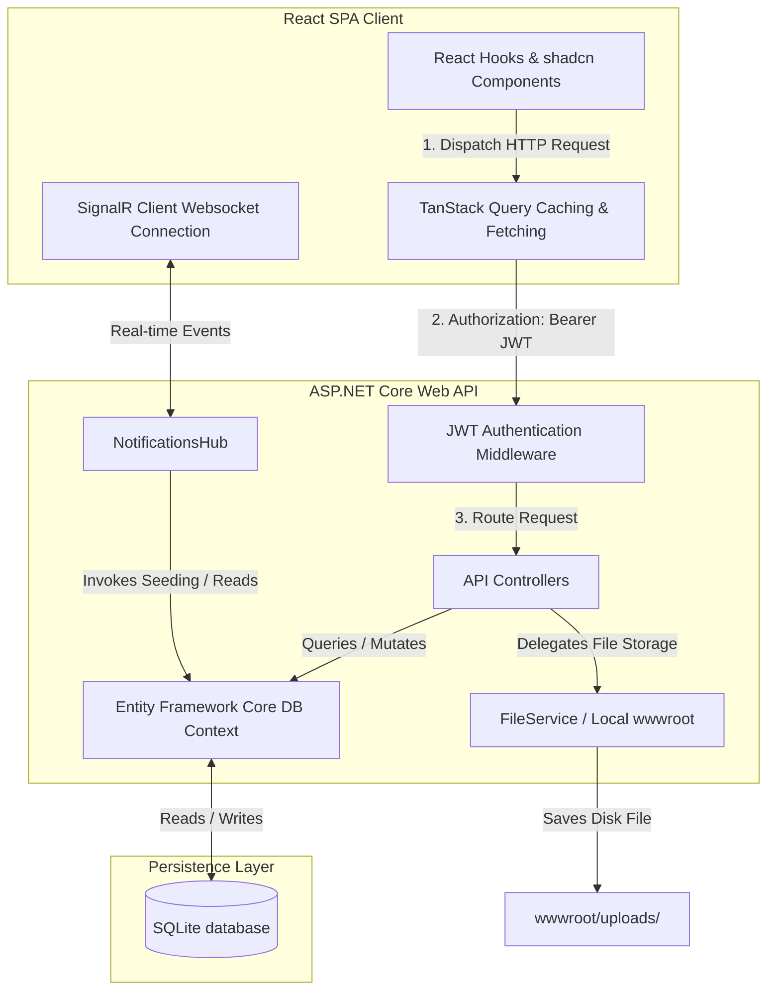
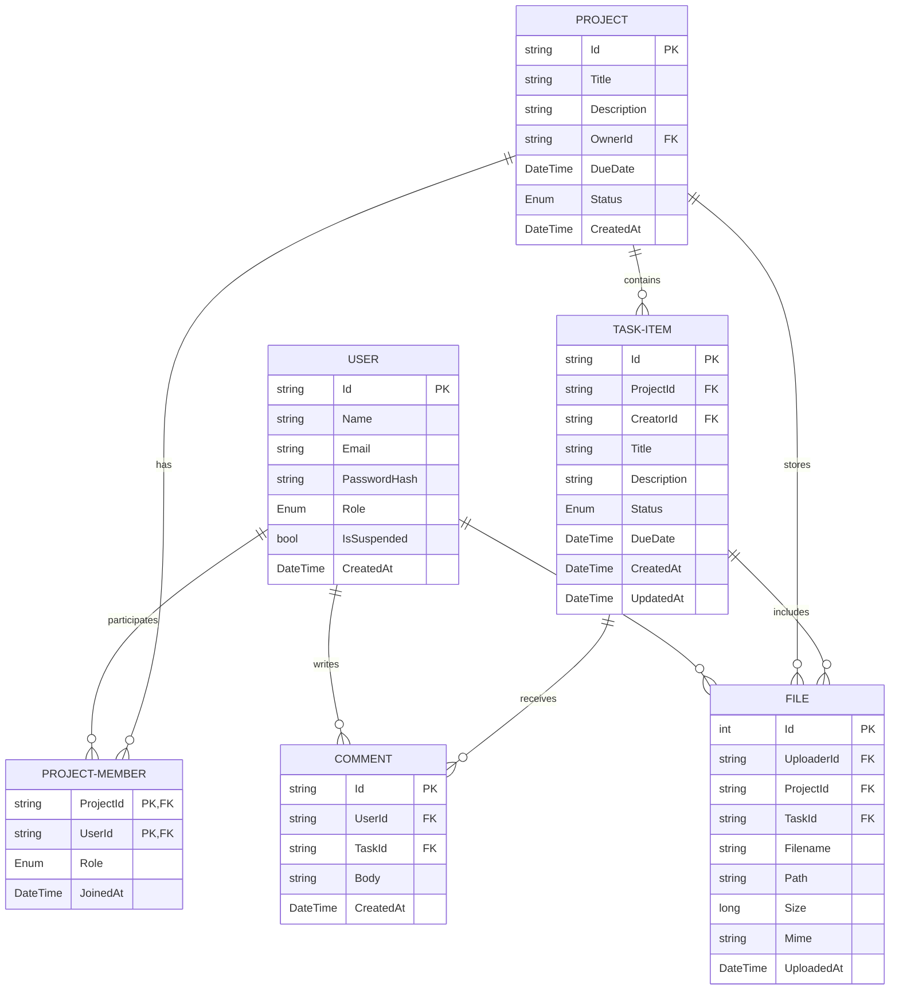

# Project Context: ClientPortal

Welcome to the **ClientPortal** project workspace. This document serves as a comprehensive system overview, architectural blueprint, and technical reference. It is designed to compile the core context of the application for portfolio presentation, onboarding, or future design reviews.

> [!NOTE]  
> **Framework Note:** While standard boilerplate templates often assume a PHP/Laravel stack, this specific project is built using a modern decoupled architecture: an **ASP.NET Core Web API (C#/.NET 9)** backend paired with a **React (TypeScript/Vite/Tailwind CSS/shadcn-ui)** frontend. This guide is tailored precisely to this actual codebase implementation.

---

## 1. Project Overview & Value Proposition

**ClientPortal** is a secure, role-based workspace bridging the gap between freelancers (collaborators) and clients (customers) to streamline project execution, task management, and document delivery. 

### The Problem It Solves
Freelancers and agencies frequently juggle multiple messaging apps, email threads, and file-sharing links to keep clients updated. This fragmented workflow leads to missed deadlines, lost assets, and misaligned project status. Clients are often left in the dark, wondering about task completion percentages.

### The Solution (Value Proposition)
ClientPortal consolidates communication and asset management into a singular, transparent dashboard:
- **Role-Based Workspaces:** Tailored interfaces for Admins, Freelancers, and Customers so everyone gets context-appropriate tools and views.
- **Granular Transparency:** Real-time task progress metrics, activity notifications, and direct feedback channels.
- **Asset Integrity:** A central file uploads registry tied directly to projects and specific tasks, eliminating lost attachments.

---

## 2. Core Tech Stack & Architecture

The application is structured as a decoupled, single-page application (SPA) communicating over a secure RESTful API and WebSocket connection.



### Backend: ASP.NET Core API (.NET 9)
- **C# / .NET 9 Sdk:** Core runtime utilizing modern C# features.
- **Entity Framework Core (EF Core 8.0.0):** Object-Relational Mapper (ORM) configured with SQLite.
- **JWT Bearer Authentication:** Secure, stateless token-based authorization.
- **SignalR:** real-time bi-directional communication protocol using WebSockets to push notifications instantly.
- **Swagger/OpenAPI (Swashbuckle):** Automated endpoint documentation and interactive API testing sandbox.

### Frontend: React / TypeScript (Vite)
- **Vite:** High-performance, fast-refresh bundler and dev server.
- **TanStack React Query:** Server-state synchronization, caching, and background loading.
- **Tailwind CSS & shadcn/ui:** Modern CSS framework utilizing Radix UI primitives for customizable, polished component layouts.
- **React Router DOM v6:** Client-side routing with role-based dashboard landing redirection.
- **Lucide Icons:** Unified vector iconography.

---

## 3. Key Features & Functionality

### Role-Based Access Control (RBAC)
The application enforces strict boundaries using three key roles:

| Role | Target Workspace | Core Capabilities |
| :--- | :--- | :--- |
| **Admin** | `AdminDashboard` | Oversees platform health. Can suspend or unsuspend users. |
| **Freelancer** | `FreelancerDashboard` | Project Creator. Creates projects, invites clients (customers), initiates tasks, updates task progress (Todo, InProgress, Done, Canceled), uploads project deliverables, and posts task comments. |
| **Customer** | `CustomerDashboard` | Client. Views invited projects, tracks task statuses, downloads files, and posts feedback/comments on tasks. |

### Real-Time Notification System
Powered by **SignalR** and integrated directly with backend operations. When a freelancer creates a task or changes a status:
1. The backend triggers the `INotificationService`.
2. The service queries project memberships.
3. The server pushes an event over `NotificationsHub` to the specific user groups (`Groups.AddToGroupAsync(connectionId, userId)`).
4. Clients receive a responsive toast notification instantly, without manual page refreshes.

### Task and Document Workspace
A centralized kanban/list view (`ProjectWorkspace`) displaying task statuses and progress metrics.
- **Progress Tracking:** Dynamically computes task completion percentage.
- **Inline Comments:** Allows users to write notes and feedback inside specific task panels.
- **Task Attachments:** Integrates file uploads directly within the task card or project directory.

---

## 4. Database & Data Models

The SQLite database structure is managed by EF Core migrations and defined in [AppDbContext.cs](file:///C:/Users/mahmoud/Desktop/portfolio%20projects/ClientPortal%20demo/api%20-%20github/Data/AppDbContext.cs). 



### Main Entities & Relationships

1. **User ([User.cs](file:///C:/Users/mahmoud/Desktop/portfolio%20projects/ClientPortal%20demo/api%20-%20github/Models/User.cs)):** 
   Holds user credentials, status (suspended flag), and role. Password security is enforced through custom BCrypt-like hashing inside the `AuthController`.
2. **Project ([Project.cs](file:///C:/Users/mahmoud/Desktop/portfolio%20projects/ClientPortal%20demo/api%20-%20github/Models/Project.cs)):**
   The primary unit of collaboration. Owned by a `Freelancer` (Collaborator) and shared with multiple `Users` (Customers/Viewers).
3. **ProjectMember ([ProjectMember.cs](file:///C:/Users/mahmoud/Desktop/portfolio%20projects/ClientPortal%20demo/api%20-%20github/Models/ProjectMember.cs)):**
   A join table establishing a **Many-to-Many** relationship between `Users` and `Projects`, enforcing granular roles (`Viewer` vs. `Collaborator`) for workspace access.
4. **TaskItem ([TaskItem.cs](file:///C:/Users/mahmoud/Desktop/portfolio%20projects/ClientPortal%20demo/api%20-%20github/Models/TaskItem.cs)):**
   Belongs to a project. Tracks progress from `Todo` through to `Done`.
5. **Comment ([Comment.cs](file:///C:/Users/mahmoud/Desktop/portfolio%20projects/ClientPortal%20demo/api%20-%20github/Models/Comment.cs)):**
   A **One-to-Many** relationship from `TaskItem` and `User` representing thread commentary.
6. **FileEntity ([FileEntity.cs](file:///C:/Users/mahmoud/Desktop/portfolio%20projects/ClientPortal%20demo/api%20-%20github/Models/FileEntity.cs)):**
   Relates to `User`, `Project`, and optionally `TaskItem`, storing physical file paths and mime metadata.

---

## 5. Key Technical Challenges & Solutions

During development, several complex architectural hurdles were resolved:

### A. JWT Authentication and SignalR Integration
* **Challenge:** WebSockets do not support standard HTTP headers (like `Authorization: Bearer <token>`) during handshake connections initiated by browsers.
* **Solution:** Configured the `JwtBearerEvents` callback in `Program.cs` to intercept the query string token parameter for SignalR connections:
  ```csharp
  options.Events = new JwtBearerEvents {
      OnMessageReceived = ctx => {
          var accessToken = ctx.Request.Query["access_token"];
          var path = ctx.HttpContext.Request.Path;
          if (!string.IsNullOrEmpty(accessToken) && path.StartsWithSegments("/hubs/notifications")) {
              ctx.Token = accessToken;
          }
          return Task.CompletedTask;
      }
  };
  ```
  This allowed safe, token-validated group connections where users are mapped to their respective project hub channels dynamically.

### B. Safe and Secure File Storage Flow
* **Challenge:** Saving raw files with original user-inputted filenames risks file-system path injection and filename collisions.
* **Solution:** Created an isolated `FileService` utilizing a GUID-based hashing schema:
  ```csharp
  var safeName = $"{Guid.NewGuid()}_{Path.GetFileName(file.FileName)}";
  var full = Path.Combine(uploads, safeName);
  using (var stream = File.Create(full)) {
      await file.CopyToAsync(stream);
  }
  ```
  Original filenames are tracked in the database to display user-friendly labels in the frontend, while storage files remain obfuscated and safe.

### C. Role-Based Navigation Redirection
* **Challenge:** Directing users to distinct dashboards based on authentication claims without introducing flash frames or page flickering.
* **Solution:** Handled role normalization and routing decisions at the highest layout level inside `App.tsx`:
  ```tsx
  <Route path="/" element={user ? (
    (() => {
      if (user.role === 'freelancer') return <FreelancerDashboard />;
      if (user.role === 'customer') return <CustomerDashboard />;
      return <AdminDashboard />;
    })()
  ) : <Login />} />
  ```
  Using local context caching in React combined with validation checks inside custom hook logic (`useAuth`) ensured instantaneous, secure client redirection.

---

## 6. How to Run & Verify

### Backend Setup (API)
1. Install the .NET 9 SDK.
2. Navigate to the `api - github/` folder.
3. Run the migrations and start the server:
   ```bash
   dotnet restore
   dotnet ef database update
   dotnet run
   ```
4. The API will start at the configured local port (typically `http://localhost:5000` or `https://localhost:5001`).

### Frontend Setup (Client)
1. Ensure Node.js (v18+) is installed.
2. Navigate to the `app - github/` folder.
3. Install dependencies and start the Vite dev server:
   ```bash
   npm install
   npm run dev
   ```
4. Open your browser and navigate to `http://localhost:3000` (or the Vite assigned port).
5. Log in using the seeded test accounts:
   - **Freelancer Account:** `freelancer@local.com` (Password: `123`)
   - **Customer Account:** `customer@local.com` (Password: `123`)
   - **Admin Account:** `admin@local.com` (Password: `123`)
