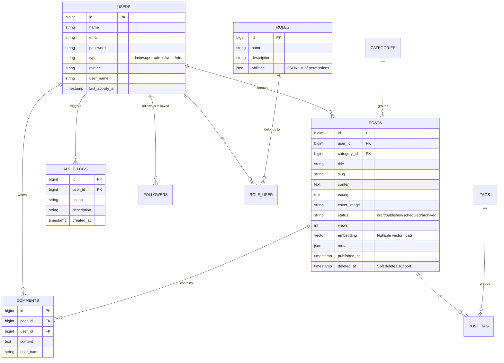

# CONTEXT.md: Project Overview & Tech Stack (WriteAI / DevLog)

This document serves as the technical blueprint and foundational context for **WriteAI** (internal project codename: *DevLog*), a modern, high-performance blogging and content-publishing platform enhanced with agentic AI writing capabilities.

---

## 1. Project Overview & Value Proposition

**WriteAI** is designed to solve the challenge of modern content creation and curation. Instead of simple text-editors, WriteAI provides writers with an **interactive, agentic writing assistant** that directly manipulates the document editor, generates high-quality SEO metadata, and manages scheduling, all within a secure, multi-tenant workspace.

### Core Value Propositions:
- **Stateful AI Collaboration**: A co-pilot interface that understands instructions to stream, append, or rewrite markdown content in the editor on the fly.
- **Dynamic SEO Strategy**: Automated generation of SEO keywords, metadata descriptions, and summaries powered by structured model outputs.
- **Advanced Discovery**: Hybrid search that leverages vector embeddings for semantic query matching, with a seamless fallback to keyword search.
- **Enterprise-Grade Access Control**: Dynamic role-based security mapping database-defined permissions directly to routes and Blade views.

---

## 2. Core Tech Stack & Architecture

WriteAI is built on a clean, scalable architectural pattern combining Laravel's powerful ecosystem with a lightweight, responsive frontend.

### Tech Stack Breakdown:
- **Backend Framework**: [Laravel v13.7](file:///C:/Users/mahmoud/Desktop/elancer/write-ai/composer.json#L12) running on **PHP 8.4**.
- **AI Orchestration**: [Laravel AI SDK v0.7](file:///C:/Users/mahmoud/Desktop/elancer/write-ai/composer.json#L10) for configuring model providers (OpenAI, Anthropic, Gemini, Groq, xAI, etc.), stateful conversation tracking, and structured output parsing.
- **Authentication**: [Laravel Fortify v1.37](file:///C:/Users/mahmoud/Desktop/elancer/write-ai/composer.json#L11) (providing headless session-based login, password reset, 2-Factor Authentication, and WebAuthn Passkeys).
- **API Token Security**: [Laravel Sanctum v4.0](file:///C:/Users/mahmoud/Desktop/elancer/write-ai/composer.json#L13) for guarding API resources.
- **Real-Time Layer**: [Laravel Echo](file:///C:/Users/mahmoud/Desktop/elancer/write-ai/package.json#L12) + [Pusher PHP Server SDK](file:///C:/Users/mahmoud/Desktop/elancer/write-ai/composer.json#L15) for real-time notifications and feed updates.
- **Frontend & Styling**: **Blade Templates** styled with [Tailwind CSS v4.0](file:///C:/Users/mahmoud/Desktop/elancer/write-ai/package.json#L15) (using `@tailwindcss/vite` integration) for high-performance utility styles, along with Alpine.js and Plotly.js for interactive dashboard metrics.
- **Development Tooling**: [Laravel Boost v2.4](file:///C:/Users/mahmoud/Desktop/elancer/write-ai/composer.json#L19) and [Laravel Pail](file:///C:/Users/mahmoud/Desktop/elancer/write-ai/composer.json#L20) for agent-assisted debugging and advanced terminal logs.

---

## 3. Key Features & Functionality (Technical Breakdown)

### 3.1. Agentic AI Writing Co-Pilot (Streaming Editor Integration)
A conversational interface lets users dictate topics or request content edits, streaming response tokens directly into the Markdown editor.
*   **Agent Logic**: Implemented in [WriteAgent.php](file:///C:/Users/mahmoud/Desktop/elancer/write-ai/app/Ai/Agents/WriteAgent.php). Uses the `RemembersConversations` trait to maintain state across messages.
*   **Instruction Set**: The agent outputs custom XML-like markup tags:
    *   `<title>...</title>` to set/update the document title.
    *   `<write>...</write>` to append content at the current cursor position.
    *   `<rewrite>...</rewrite>` to completely replace the editor's text.
    *   `<replace><old>...</old><new>...</new></replace>` to run targeted regex find-and-replaces on existing text.
*   **Streaming Parsing**: [_form.blade.php](file:///C:/Users/mahmoud/Desktop/elancer/write-ai/resources/views/dashboard/posts/_form.blade.php#L901-L1060) runs a custom delta stream parser that reads incoming chunks using JavaScript `fetch` reader streams, updates the conversational chatbot bubbles, and modifies the DOM element inputs dynamically based on partial or completed tags.

### 3.2. Dynamic SEO & Structured AI Data Modeling
Saves writers time by automatically analyzing content to produce SEO assets.
*   **Structured Output**: Implemented in [SeoAgent.php](file:///C:/Users/mahmoud/Desktop/elancer/write-ai/app/Ai/Agents/SeoAgent.php#L47-L56) utilizing the Laravel AI SDK schema builder (`JsonSchema` contract) to enforce typing for `title`, `description`, `summary`, and `keywords`.
*   **PostService Workflow**: On post creation inside [PostService.php](file:///C:/Users/mahmoud/Desktop/elancer/write-ai/app/Services/PostService.php#L42-L51), the controller delegates formatting to `SeoAgent` to extract rich metadata under a single unified database transaction.

### 3.3. Hybrid Vector Search with Relational Fallback
Combines advanced semantic embeddings searches with standard database querying.
*   **Vector Search**: Uses the Laravel AI SDK `Str::toEmbeddings()` to calculate user query weights.
*   **Driver-Specific Queries**: In [SearchController.php](file:///C:/Users/mahmoud/Desktop/elancer/write-ai/app/Http/Controllers/SearchController.php#L23-L56), the code automatically detects database systems:
    *   *PostgreSQL*: Applies the L2 operator `embedding <-> ?`.
    *   *MySQL*: Applies the `VECTOR_DISTANCE(embedding, string_to_vector(?))` function.
*   **Dynamic Fallback**: If vector models are unconfigured or the database fails to parse vector types, a `try/catch` fallback instantly redirects queries to a legacy relational SQL query matching titles, contents, excerpts, and tags.

### 3.4. Multi-Tenant Eloquent Scopes
Enforces data security between writers by automatically scoping dashboard listing results.
*   **Attribute Routing Scopes**: Models use modern PHP Attributes for global scoping, e.g., `#[ScopedBy(OwnerScope::class)]` and `#[ScopedBy(PublishedScope::class)]` inside [Post.php](file:///C:/Users/mahmoud/Desktop/elancer/write-ai/app/Models/Post.php#L17-L18).
*   **Contextual Multi-Tenancy**: [OwnerScope.php](file:///C:/Users/mahmoud/Desktop/elancer/write-ai/app/Models/Scopes/OwnerScope.php#L15-L26) verifies if the request occurs on `dashboard.*` routes. If so, it intercepts query generation to append `where('user_id', auth()->id())` automatically, except for admin accounts.

### 3.5. Dynamic Role-Based Access Control (RBAC)
A flexible authentication middleware that maps user roles directly to permissions without hardcoding strings.
*   **Ability Definition**: Configured inside [abilities.php](file:///C:/Users/mahmoud/Desktop/elancer/write-ai/config/abilities.php) and validated inside [AppServiceProvider.php](file:///C:/Users/mahmoud/Desktop/elancer/write-ai/app/Providers/AppServiceProvider.php#L27-L48).
*   **Middlewares**: [CheckDbRole.php](file:///C:/Users/mahmoud/Desktop/elancer/write-ai/app/Http/Middleware/CheckDbRole.php) and [CheckDbPermission.php](file:///C:/Users/mahmoud/Desktop/elancer/write-ai/app/Http/Middleware/CheckDbPermission.php) validate permissions based on DB roles, while [EnsureUserType.php](file:///C:/Users/mahmoud/Desktop/elancer/write-ai/app/Http/Middleware/EnsureUserType.php) enforces hard system limits.
*   **Blade Integration**: Custom `@role` and `@permission` directives are compiled inside [AppServiceProvider.php](file:///C:/Users/mahmoud/Desktop/elancer/write-ai/app/Providers/AppServiceProvider.php#L36-L47) to guard UI buttons and widgets.

---

## 4. Database & Data Models

The database schema manages relational user feeds, real-time metrics, roles, and AI histories.

### Core Entities:
1.  **User**: Standard authenticatable account containing roles, dynamic username mappings, follow counts, and session indicators.
2.  **Post**: The core publishing unit, supporting soft deletes, scheduled releases, JSON metadata attributes, and multi-tenant scoping.
3.  **Role**: Houses a JSON `abilities` field which lists individual operations granted to associated users (e.g. `users.view`, `users.edit`).
4.  **Category / Tag / Comment**: Standard relational content taxonomy.
5.  **AuditLog**: Maintains track of key user actions (suspensions, resets, deletes) for administrators.
6.  **AgentConversation / AgentConversationMessage**: Tracks conversation history for the AI SDK chat persistence.

---

## 5. Key Technical Challenges Overcome

### 5.1. Real-time Streaming Parsing of Malformed XML
*   **The Problem**: AI models stream content chunk-by-chunk. During generation, tags like `<write>` appear as partial strings (e.g., `<wr` or `<write>In progress...`). A standard regex parser will fail to match them or throw exceptions, leading to broken HTML renders in the editor or leaking raw markup in the chatbot conversational panel.
*   **The Solution**: Developed a delta-aware parsing algorithm inside `parseAndApply()`. The parser computes the conversational text by removing full/partial tag patterns, ensuring chatbot messages stream seamlessly. For content edits (like `<write>`), the parser keeps track of the previous chunk length, inserting only the new "delta string" into the cursor context while stripping incomplete trailing tag structures using a safety utility (`cleanPartialTags`).

### 5.2. Cross-Driver Database Vector Search Abstraction
*   **The Problem**: Creating search indexing queries that utilize cosine/L2 distance vectors varies wildly between DBMS drivers (Postgres utilizes pgvector `<->` operators, MySQL uses `VECTOR_DISTANCE()`, SQLite doesn't natively support vectors without extensions). Hardcoding queries locks the application to a single environment.
*   **The Solution**: Implemented driver sniffing inside `SearchController::index()`. The controller inspects `DB::connection()->getDriverName()`, dynamically injecting the correct raw SQL vector formulas based on the active connection. A wrapping `try/catch` ensures that if a local developer setup runs SQLite or MySQL without vector support, the application fails gracefully by reverting to full-text relational matching without throwing error screens.

### 5.3. Multi-Tenant Scopes in Console/Queue Environments
*   **The Problem**: Restricting post queries using `Route::is('dashboard.*')` in `OwnerScope` works perfectly during HTTP requests. However, when database actions are queued, triggered via Artisan Commands, or executed in Unit Tests, the route context is null. This throws errors or incorrectly filters queries.
*   **The Solution**: Structured `OwnerScope` to perform defensive checks. The scope only triggers constraints if `auth()->check()` is true and `Route::is('dashboard.*')` yields a positive match, ensuring background queue workers and test runners can process documents globally without access exceptions.
