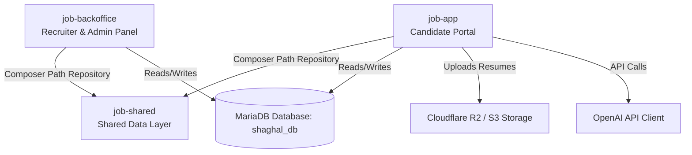
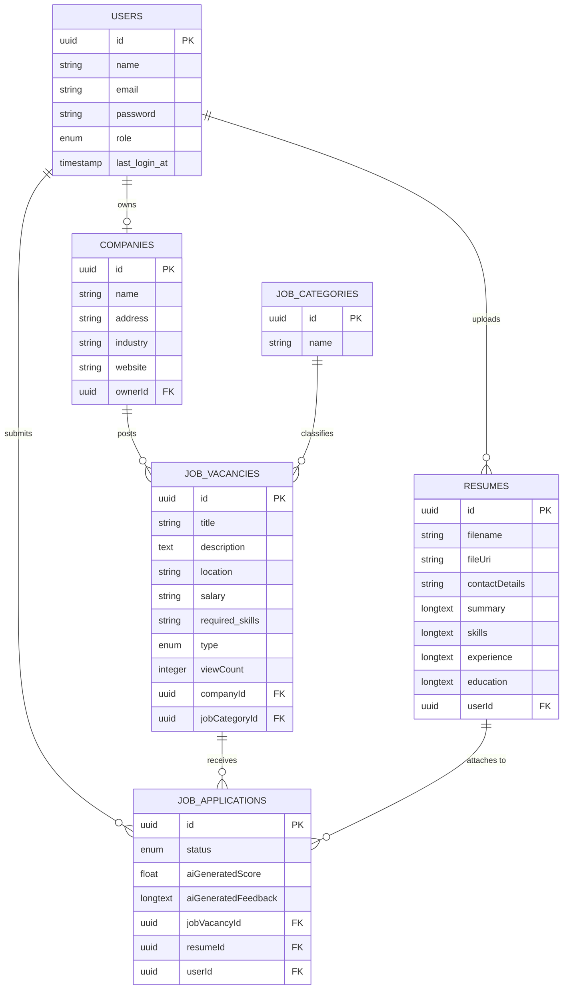

# Shaghal Job Board Platform - Technical Context

This document provides a comprehensive overview of the technical architecture, design choices, data models, and features of the **Shaghal Job Board** platform. It serves as the foundational technical context for the developer's portfolio.

---

## 1. Project Overview & Value Proposition

**Shaghal** (meaning *"employ"* or *"busy"* in Arabic) is a modern, AI-enhanced recruitment and job board platform. The platform is designed to streamline the connection between job seekers, employers, and system administrators through a dual-portal ecosystem.

### The Problem It Solves
Recruitment platforms are often fragmented or place a heavy administrative burden on recruiters to filter and score candidates manually. Shaghal addresses this by:
- **For Candidates:** Providing an intuitive, fast portal to search, filter, and apply for vacancies by uploading a PDF resume.
- **For Employers (Company Owners):** Providing direct control over company profiles, job vacancies, and application status, along with candidate matching diagnostics.
- **For Administrators:** Offering a centralized control center to monitor user accounts, onboard companies, categorize vacancies, and audit platform activities.

### Value Proposition
A highly optimized, dual-application monorepo architecture sharing a unified Eloquent data layer. The platform implements automated resume parsing, candidate match scoring, and real-time recruitment metrics (like job vacancy conversion rates) to significantly reduce the time-to-hire.

---

## 2. Core Tech Stack & Architecture

The project is structured as a **monorepo** consisting of two independent Laravel web applications and a shared PHP package.

### Architecture Breakdown
1. **Candidate Portal (`job-app`):**
   - A client-facing application where job seekers register, upload resumes, browse vacancies, and track their applications.
   - Built on **Laravel 12** and **PHP 8.2+**.
   - Integrates **Laravel Breeze** (Blade stack) for authentication.
   - Leverages **OpenAI** (`openai-php/laravel`) for AI-driven resume parsing and candidate matching.
   - Utilizes Cloudflare R2 / AWS S3 storage via **Flysystem S3** for secure resume file handling.

2. **Recruiter & Admin Panel (`job-backoffice`):**
   - An administrative dashboard for company owners and system admins.
   - Built on **Laravel 12** and **PHP 8.2+**.
   - Features custom role-based middleware (`admin`, `company-owner`) to enforce strict security boundaries.
   - Provides analytics, CRUD controls for companies, categories, vacancies, and application management.

3. **Shared Data Layer (`job-shared`):**
   - A local Composer library (`job/shared`) loaded as a path repository.
   - Houses all Eloquent models (`User`, `Company`, `JobVacancy`, `JobCategory`, `Resume`, `JobApplication`) under the shared `App\Models` namespace.
   - Eliminates duplicate database logic, relations, and attribute casts, keeping the codebase DRY (Don't Repeat Yourself).

### Technology Stack Summary
- **Backend:** Laravel 12 (PHP 8.2), Eloquent ORM, Custom Middleware, Form Requests.
- **Frontend:** Laravel Blade, TailwindCSS, Vite.
- **Database:** MariaDB / MySQL (`shaghal_db`), running UUID-based primary keys and soft-delete features.
- **Cloud Integrations:** Cloudflare R2 (Object Storage), OpenAI API (gpt-5-mini / gpt-4o endpoints for resume assessment).
- **Testing:** Pest PHP.

---

## 3. Key Features & Functionality

### Front-Office (`job-app`)
- **Interactive Job Search & Filtering:** Candidates search by title, location, or company, and filter vacancies dynamically by type (`Full-Time`, `Contract`, `Remote`, `Hybrid`).
- **File Upload & Cloud Storage:** PDF resumes are securely uploaded and stored directly on a cloud storage bucket (R2/S3), rendering the application server stateless.
- **AI Match Analysis (Pipeline Stub):**
  - **Resume Parsing:** Uses AI to extract details (Summary, Experience, Education, Skills) from uploaded PDF resumes into a structured format.
  - **Suitability Scoring:** Automatically evaluates candidate profiles against vacancy requirements to calculate an matching score and generate actionable feedback.

### Back-Office (`job-office`)
- **Role-Based Workflows:**
  - **Company Owners:** Can only manage vacancies, view statistics, and update details for *their own company*.
  - **Admins:** Have global visibility to onboard companies, create vacancy categories, manage users, and restore soft-deleted models.
- **Analytics Dashboard:**
  - Computes active user logins (last 30 days).
  - Displays the most popular jobs based on application volume.
  - Computes **Conversion Rates** in real time:
    $$\text{Conversion Rate} = \frac{\text{Total Applications}}{\text{Job Vacancy View Count}}$$
- **Auditing & Archive Controls:** Fully supports Eloquent Soft Deletes, allowing admins to safely delete and restore records (users, companies, vacancies, categories, and applications) from the UI.

---

## 4. Database & Data Models

The database design uses **UUIDs** (Universally Unique Identifiers) for all primary keys to obscure internal IDs and enable secure sharing of identifiers across applications.

### Core Entities & Relationships
- **User:** Represents all platform users. Role dictates portal access (`job-seeker` has candidate views; `company-owner` and `admin` have backoffice views).
- **Company:** Created by admins and assigned to a `User` (acting as the `owner`). Has many vacancies.
- **Job Category:** Defines vacancy categories (e.g., Technology, Engineering) to support structured browsing.
- **Job Vacancy:** Created by company owners/admins. Tracks job descriptions, requirements, and views (`viewCount`).
- **Resume:** Holds the candidate's PDF file path (`fileUri`) and structured text profiles (summary, experience, education, skills).
- **Job Application:** Connects a `User` and their `Resume` to a specific `JobVacancy`. Tracks application status (`pending`, `accepted`, `rejected`), along with AI score and feedback.

---

## 5. Key Technical Challenges Overcome

### 1. Unified Models in a Monorepo (`job-shared`)
* **Challenge:** Duplicating Eloquent models and relationship maps across both `job-app` and `job-backoffice` causes code drift and database sync bugs.
* **Solution:** Created the local library `job-shared` using Composer's path repository mapping. By configuring the shared PSR-4 autoloader to map the `App\\` namespace to `job-shared/src/`, both Laravel projects instantiate identical model classes, validation settings, and attributes seamlessly.

### 2. Multi-Tenant Role Isolation
* **Challenge:** Preventing company owners from accessing applications or statistics of other companies, while keeping administrative code simple.
* **Solution:** Utilized Laravel's Eloquent relationships and contextual check logic in the controllers. Company owners query metrics using `$company->jobVacancies()->withCount(...)` to scope database queries dynamically, and a custom role-based middleware (`RoleMiddleware`) filters request access before hitting controllers.

### 3. File Pipeline & Cloud Storage Integration
* **Challenge:** Hosting PDF resumes on local server filesystems creates stateful servers, making deployment scaling difficult.
* **Solution:** Integrated the AWS S3 driver mapped to Cloudflare R2 bucket credentials inside `config/filesystems.php`. Resumes are stored securely in R2, leaving application servers stateless and optimized for cloud scalability.

### 4. AI Prompting and Scoring Integration
* **Challenge:** Evaluating resumes against job vacancies is highly subjective and time-consuming.
* **Solution:** Set up `openai-php/laravel` client to parse resume text against job vacancies. Designed a pipeline (implemented via `ResumeAnalysisService`) to output structured JSON data containing a suitability score and detailed feedback, populating `aiGeneratedScore` and `aiGeneratedFeedback` in database applications.
